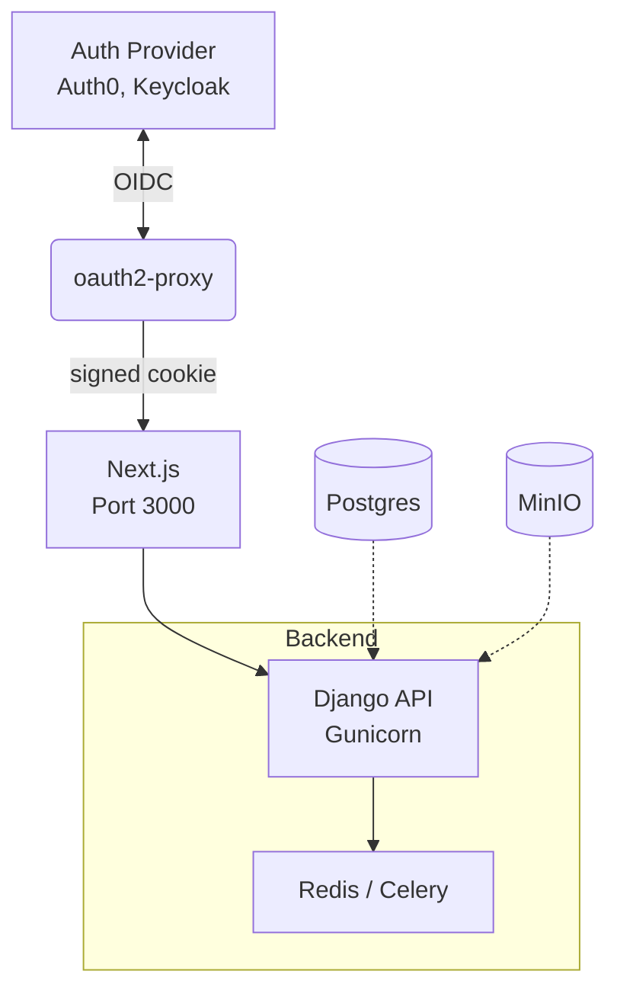

# Social-Media Poster — End-to-End Productization Plan  

*(Django · React/Next.js · Docker · Celery · GitHub Actions)*

---

## 1  Current Prototype Snapshot
| Layer              | Status | Notes                                         |
| ------------------ | :----: | --------------------------------------------- |
| **Front-end UI**   |   ✔    | Basic page lets user compose & schedule posts |
| **Back-end API**   |   ✔    | Django REST; stores `Post`, `Asset`, `Social` |
| **Scheduling**     |   ✔    | APScheduler in-process                        |
| **Integrations**   |   ✔    | Twitter / X (v2), Bluesky, MinIO blob store   |
| **Infrastructure** |   ✔    | Docker Compose for Postgres + MinIO           |

---

## 2  12-Week Road-to-Production Plan

|                           Sprint | Theme                       | Key Outcomes                                                                                                                                                                                                                  |
| -------------------------------: | --------------------------- | ----------------------------------------------------------------------------------------------------------------------------------------------------------------------------------------------------------------------------- |
|        **0 — Hardening** (2 wks) | **Code Quality & Security** | * Migrate scheduling → **Celery + Redis**<br>* Introduce driver interface `BaseSocialBackend` (easy add-ons)<br>* Secret encryption → *django-fernet-fields* (or KMS)<br>* Unit tests with **pytest-django**, pre-commit lint |
|          **1 — CI / CD** (2 wks) | **Automation**              | * GitHub Actions pipeline: `test → buildx → push GHCR`<br>* Deploy job (SSH + `docker compose pull && up`) to **staging** VM<br>* README: local bootstrap & CI steps                                                          |
|     **2 — Observability** (1 wk) | **Visibility**              | * **Sentry** (error tracking)<br>* **Prometheus + Grafana** metrics<br>* `/healthz` + Docker `HEALTHCHECK`                                                                                                                    |
|   **3 — Authentication** (2 wks) | **Enterprise SSO**          | * **Keycloak + oauth2-proxy** in front of Next.js<br>* Signed cookie / headers → user context in React                                                                                                                        |
|     **4 — Instagram GA** (2 wks) | **First new network**       | * Graph API driver (image & video)<br>* UI toggle; integration tests with **pytest-vcr**                                                                                                                                      |
| **5 — Launch Readiness** (3 wks) | **Ops & Compliance**        | * Blue-green deploy (`compose-alpha / beta`)<br>* Nightly Postgres & MinIO backups → S3<br>* GDPR delete endpoint, post-mortem template<br>* Architecture docs & 5-min Loom demo                                              |

---

## 3  Target Architecture



* **Gunicorn** serves Django API  
* **Celery workers** handle scheduled posts  
* **Postgres** & **MinIO** on persistent volumes  

---

## 4  Deployment Stack

| Component | Choice                                           |
| --------- | ------------------------------------------------ |
| Runtime   | Ubuntu 22.04 VPS · Docker 24 · docker-compose v2 |
| Ingress   | **Caddy** (auto-TLS → `kirongonidis.com`)        |
| Data      | Postgres 16 · MinIO (S3 API)                     |
| Secrets   | GitHub Encrypted Secrets → CI → `.env`           |

> The same `docker-compose.yml` runs locally, in CI, and on the VPS.

---

## 5  Deliverables

1. **Repository layout**
   ```
   backend/          Django app & unit tests
   frontend/         Next.js UI
   ops/              docker-compose, Caddyfile, Terraform (optional)
   .github/workflows/ci.yml  cd-prod.yml
   docs/architecture.md
   README.md
   ```
2. **Live staging demo** — <https://stage.kirongonidis.com>
3. **Documentation pack**
   * Architecture markdown & diagrams
   * One-command local bootstrap (`make dev`)
   * 5-minute Loom walkthrough

---

## 6  KPIs for Launch

| Metric                           |       Target |
| -------------------------------- | -----------: |
| Post latency (p95)               |   **< 15 s** |
| Failed post rate                 |    **< 1 %** |
| API latency (p95)                | **< 200 ms** |
| Deployment rollback (blue-green) |  **< 2 min** |
| Unit-test coverage               |   **≥ 80 %** |

---

## 7  Feature Back-Log (post-launch)

* LinkedIn & Facebook drivers (reuse driver interface)  
* Real-time analytics dashboard (webhooks → WebSocket push)  
* Multi-tenant SaaS mode with Stripe usage-based billing  
* Mobile-friendly PWA compose screen  

---

### Summary

This phased roadmap converts the working prototype into a **secure, observable, CI/CD-driven product** ready for production campaigns while establishing a foundation to add more social networks and SaaS capabilities.